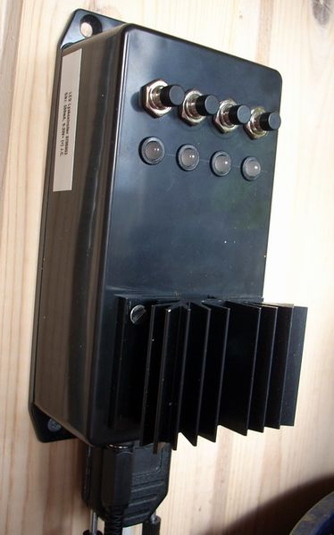

## Source code for project: [Electronic switch with 4 channels and voltage regulator](https://link.stdout.no/P)

Electronic switch for LED lights, 4 channels, 9 to 24 volts in, 5 volts out. Uses an AVR ATtiny2313 microcontroller.

Written in basic, using [Bascom-AVR](http://www.mcselec.com/).

### Author
[Thomas Jensen](https://thomas.stdout.no)
